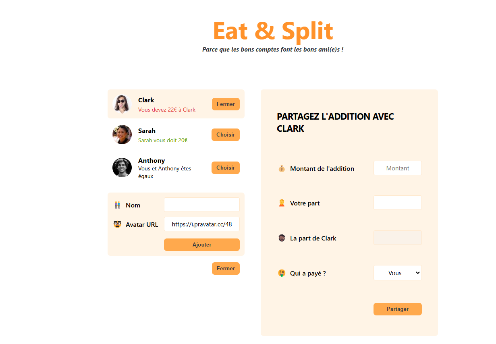

# Friend Balance Tracker


Easily track and manage shared expenses with **Friend Balance Tracker**! This app helps you keep a clear record of who owes whom in your friend group. Add friends, log shared expenses, and automatically calculate balances to avoid awkward money misunderstandings.

---

## How to Use
For local use:
1. Ensure **Node.js** and **npm** are installed on your system.
2. Run the following commands in your terminal:
   ```bash
   npm install
   npm start

### Features
- Add or chose an existing friend
- If new friend choose a ramfom avatar by changing the number at the and of the url
- Log a shared expense: Add a new entry with the following details:
- Total bill amount.
- Your share of the amount.
- Who paid.
- Automatic balance updates: The app calculates and displays the balance for each friend, showing who owes whom and by how much.

### Dependencies
This project uses the following tools and libraries:

Node.js and npm for package management and running the app.
React for the front-end framework